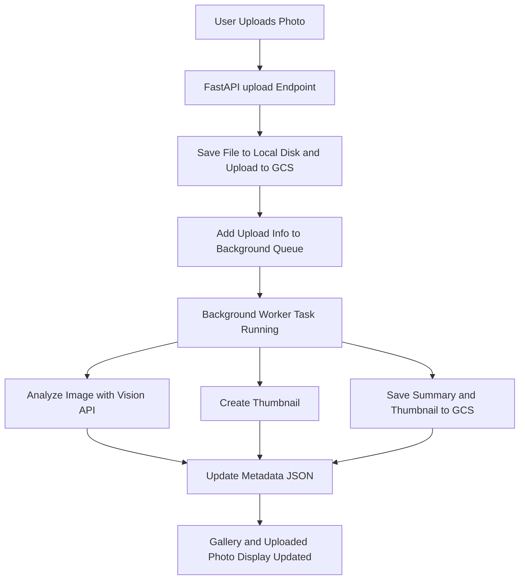

# 📸 Tracker App

[](https://www.python.org/)
[](https://fastapi.tiangolo.com/)

[](https://www.docker.com/)
[]()
[](https://github.com/ropeck/tracker/actions/workflows/test-and-coverage.yml)
[](https://github.com/astral-sh/ruff)
[](https://bandit.readthedocs.io/)
[](https://github.com/codespell-project/codespell)

Simple. Organized. Searchable. Your real-world objects, finally remembered.


## Home Inventory & Object Memory System


A fast, AI-assisted inventory and object tracking system for making sense of physical clutter — gear, cables, tools, sentimental objects — by combining photo metadata, NFC tagging, and domain-specific reasoning. Designed to support memory, cleanup, travel prep, and donation workflows.


---

## Why This Exists

We all accumulate gear, cables, tools, and sentimental objects that eventually blur into a pile. This system helps catalog them *with context* — where they are, what they're for, whether they're still needed — and gives gentle guidance when it's time to find, use, or let go.

---

## Core Ideas

- NFC tags + readers on bins, shelves, tools
- Photo recognition + AI tagging
- ChatGPT-style prompts like:
  - “Where does this go?”
  - “Do I already have one?”
  - “Is this ready to take on a trip?”
- Travel checklists, donation suggestions, usage stats


---

## Modules

- `/scripts/logger.py` – Main FastAPI app (photo upload, queue, gallery search)
- `/scripts/vision.py` – OpenAI Vision API wrapper
- `/scripts/auth.py` – Google OAuth2 integration
- `/templates/` – HTML templates for gallery and layout
- `/uploads/` – User images, thumbnails, and AI-generated summaries
- `/data/` – (Reserved) for structured object metadata and tag maps
- `/docs/` – Planning, vision, usage notes, and changelogs

## 📈 Upload Flow




## 🧪 Testing

### 🔧 One-Time Setup

To set up the Python virtual environment and install dependencies:

```bash
make dev
```

This creates a `venv/` directory and installs required packages from `requirements.txt`.

---

### ✅ Running Tests

To run all unit tests:

```bash
make test
```

To run tests with coverage and see which lines are missing:

```bash
make coverage
```

To open the HTML coverage report in your browser:

```bash
make open-coverage
```

---

### 🧹 Cleaning Up

To remove the virtual environment, test cache, and coverage reports:

```bash
make clean
```


---

## MVP Status - April 19, 2025 ✅

The following core system features are live at [https://home.fogcat5.com](https://home.fogcat5.com):

- Upload photos from the web interface
- View uploaded photo history with timestamps
- Deployed via Docker + Kubernetes on GKE
- Full domain name + HTTPS with cert-manager and Let's Encrypt
- NGINX ingress configured for larger image uploads

## [2025-04-20] MVP Deployment Complete

- 🧠 Added OpenAI Vision API integration with GPT-4o
- 📷 File uploads with image preview and thumbnailing
- 🔍 Inventory object detection and tagging from photos
- 🔐 OAuth2 login via Google, restricted to `fogcat5@gmail.com`
- 🔄 Working on K8s at `https://home.fogcat5.com`
- 🔎 Basic query/search for tags
- 🧼 Secrets and API keys now injected via K8s secret volume
- 📁 Auto-organizing project directory (`scripts`, `templates`, `uploads`, etc.)


## 🗓️ Daily Update: April 22, 2025

### ✅ What Got Done

- 📦 **Switched image uploads to Google Cloud Storage**
  - Full-size images, thumbnails, and summaries now land in `fogcat5-home/upload/`
- 🖼️ **Gallery page now reads from GCS**
  - `/photos` renders thumbnails and tags directly via GCS proxy route
- 🚀 **Added FastAPI proxy route to serve GCS files**
  - `/uploads/{filename}` handles image, thumb, and summary access with streaming
- 🧠 **Vision summaries stored alongside each image**
  - Parsed from OpenAI vision API and saved as `.summary.txt`
- 🛠️ **Improved gallery tag display**
  - Shows tags as stylized pills with links coming soon
- 🐳 **Created GitHub Actions CI pipeline**
  - Builds Docker image on `prod` branch push
  - Tags: `:latest`, `:v<run_number>`, and `:<short_sha>`
  - Pushes to Docker Hub and updates GKE deployment
- ☁️ **Auto-deploy to GKE now working!**
  - Cluster restarts pod with new image every `prod` commit

### 🍻 Vibe of the Day
- Dev soundtrack: Brad Mehldau – *"Look for the Silver Lining"*
- Beers on deck: Little Sumpin’ Sumpin’ → Atomic Torpedo IPA → CI/CD victory lap

## What's Next

- Queue background tasks to:
  - Enhance tagging with follow-up prompts
  - Suggest better naming/categories
  - Detect objects needing multiple views (e.g., mouse underside)
- Admin interface for tag cleanup and reprocessing
- NFC tag sync and label printing
- More natural language queries

Here's your focused **plan for tomorrow (April 23, 2025)** based on where we left off today:

---

## 🔜 Planned Tasks for April 23

### 🗃️ **SQLite Metadata Integration**
- [ ] Create database tables (`images`, `tags`, `image_tags`, `users`)
- [ ] Store upload metadata (filename, timestamp, label, tags) in SQLite on each upload
- [ ] Refactor `metadata.json` usage to DB-backed queries

### 🔍 **Search & Filtering**
- [ ] Implement `/photos?q=<tag>` filter using DB-backed lookup
- [ ] Make tags in the gallery clickable → link to tag-filtered photo view
- [ ] Add optional search input to `/photos` page

### 🧪 **Local Testing**
- [ ] Test upload + DB flow locally with SQLite before deploying to GKE
- [ ] Ensure backward compatibility with previously uploaded GCS images

---

## 🚧 Stretch Goals (Optional)
- [ ] Display label + notes alongside tags in gallery
- [ ] Begin wiring up Firestore logic (for future cloud-native metadata)
- [ ] Add a simple CLI script to query recent uploads by tag or date

---

## 🧘 Dev Environment Tasks (Optional)
- [ ] Add `notes/2025-04-23.md`
- [ ] Run `db init` script if SQLite doesn’t exist
- [ ] Create migration script to backfill tags from `.summary.txt` into DB

---

You’re in a perfect spot to transition from flat storage to a real search-capable tagging system. Want this dropped into tomorrow’s notes file?

---

## 🗓️ Daily Update: April 27, 2025

### ✅ What Got Done

- 🏗️ **Major Upload and Gallery UX Upgrades**
  - Added background processing queue (async) for OpenAI Vision tagging.
  - Instantly shows thumbnail and tag summaries after upload completes.
  - Improved FastAPI upload endpoint to return full `thumb_url` and `summary_url`.
- 🎯 **Fixed Form Submission and JavaScript Handling**
  - Corrected form behavior (`action="javascript:void(0)"`) to avoid unwanted submits.
  - Refined tag parsing and display into clean, styled UI elements.
- 🛠️ **Resolved Tricky FastAPI 422 Errors**
  - Fixed multipart form field handling with consistent field names.
  - Improved debugging output and fallback behaviors during upload errors.
- 📦 **Deployed New Version to GKE via GitHub Actions**
  - Branch → Pull Request → Merge to `main` → Promote to `prod`.
  - CI/CD automatically built Docker image and rolled out to Kubernetes.
- 📸 **Upload Flow Fully Working Again**
  - Upload photo → See thumbnail → See tags → View in `/photos` gallery, all live.

---

### 🍻 Vibe of the Day
- Dev soundtrack: **Anderson .Paak** – *"Come Down"*
- Beer of victory: **Discretion Local Lion West Coast IPA**
- ✨ Feeling: "**Professional web developer... but doing it for free.**"

---

## 🔥 What's Next

- 🗃️ **SQLite Metadata Integration**
  - Store uploads, labels, and tags in a proper database for faster querying.
- 🔗 **Clickable Tags and Filtered Views**
  - `/photos?q=<tag>` will show only matching tagged photos.
- 🧹 **Admin Tag Cleanup Tools**
  - Build simple interface to edit, clean, or reprocess tags.
- 📲 **Longer Term**
  - NFC tag-to-photo mapping.
  - More natural search prompts ("Show me all adapters").

## 🗓️ Daily Log — April 28, 2025

- **SQLite Integration**
  - Implemented `scripts/db.py` with helper functions: `init_db()`, `add_image()`, `add_tag()`, and `link_image_tag()`.
  - Integrated database operations into the upload pipeline, storing image metadata and associated tags.

- **Gallery Enhancements**
  - Updated `/photos` route to fetch and display images and tags from the SQLite database.
  - Enabled tag-based filtering in the gallery view.

- **Testing and Validation**
  - Conducted local testing of image uploads and gallery functionality.
  - Verified that uploaded images and tags are correctly stored and retrieved from the database.
  - also verified working on GKE in prod

## 📅 Sunday, May 4, 2025

### 🧪 Testing & Development

* **GCS Rebuild**: Implemented a `should_rebuild_db` method to determine when to rebuild the database from GCS. Added support for a `force` argument via environment variable and URL parameter.
* **Uvicorn Configuration**: Opted to use environment variables for passing arguments to Uvicorn. Set `FORCE_REBUILD` in the Kubernetes YAML to trigger a rebuild.
* **Code Enhancements**: Refactored `rebuild_db_from_gcs` for improved readability and added comprehensive docstrings. Ensured that comments wrap at 80 columns in VS Code for consistency.
* **Testing**: Conducted local testing to confirm that the rebuild logic works as expected. Verified that the database rebuilds when `FORCE_REBUILD` is set and skips when it's not.

## 📅 Tuesday, May 7, 2025

### 🧪 Testing & Deployment Pipeline

* **Unit Tests Added**: Created test suites for key modules including `db.py`, `rebuild.py`, `vision.py`, `util.py`, `auth.py`, and `logger_nfc.py`. Used `pytest`, `pytest-asyncio`, and `pytest-cov` to ensure full coverage and reliability.
* **GCS Summary Parsing**: Validated that images with empty `summary.txt` files are handled correctly and don’t trigger tag creation. Ensured timestamp-based filtering behaves as expected.
* **OpenAI Mocking**: Refactored `vision.py` to make the OpenAI client injectable. This allows mocking during tests and avoids requiring a real API key during import or test runs.
* **GitHub Actions**: Set up a `test-and-coverage.yml` workflow to run on every push and PR. Configured coverage thresholds and HTML report upload for visibility.
* **Prod Deployment Workflow**: Updated the `deploy-proy.yml` to depend on test success. It now runs only if the `test-and-coverage` workflow passes, ensuring broken builds don’t reach production.
* **Badge Added**: Included a live status badge in `README.md` to reflect the current test suite health.
