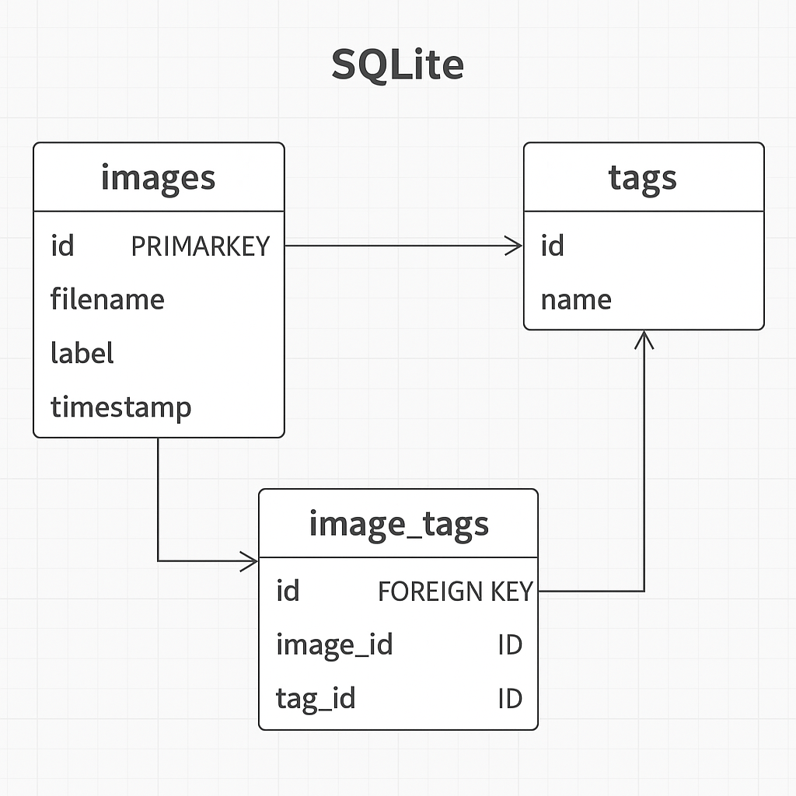

# 🛠️ Tracker App: SQLite Upgrade Plan

---

## 1. **Database Schema**

You'll need a tiny but powerful set of tables:


```sql
CREATE TABLE images (
    id INTEGER PRIMARY KEY AUTOINCREMENT,
    filename TEXT UNIQUE,
    label TEXT,
    timestamp TEXT
);

CREATE TABLE tags (
    id INTEGER PRIMARY KEY AUTOINCREMENT,
    name TEXT UNIQUE
);

CREATE TABLE image_tags (
    id INTEGER PRIMARY KEY AUTOINCREMENT,
    image_id INTEGER,
    tag_id INTEGER,
    FOREIGN KEY(image_id) REFERENCES images(id),
    FOREIGN KEY(tag_id) REFERENCES tags(id)
);
```

✅ **One image → multiple tags**  
✅ **One tag → multiple images**  
✅ **Simple join queries for filtering**

---

## 2. **Install Tiny Dependency**

Add `aiosqlite`:

```bash
pip install aiosqlite
```

_(Or regular `sqlite3` if you prefer blocking queries — for now async is nice.)_

---

## 3. **New Python Module**

Create a new file: `scripts/db.py`

It'll have helper functions like:

```python
import aiosqlite

DB_PATH = "uploads/metadata.db"

async def init_db():
    async with aiosqlite.connect(DB_PATH) as db:
        await db.executescript(open("scripts/schema.sql").read())
        await db.commit()

async def add_image(filename, label, timestamp):
    async with aiosqlite.connect(DB_PATH) as db:
        await db.execute(
            "INSERT OR IGNORE INTO images (filename, label, timestamp) VALUES (?, ?, ?)",
            (filename, label, timestamp)
        )
        await db.commit()

async def add_tag(name):
    async with aiosqlite.connect(DB_PATH) as db:
        await db.execute(
            "INSERT OR IGNORE INTO tags (name) VALUES (?)",
            (name,)
        )
        await db.commit()

async def link_image_tag(filename, tag_name):
    async with aiosqlite.connect(DB_PATH) as db:
        image_row = await db.execute_fetchone(
            "SELECT id FROM images WHERE filename = ?", (filename,)
        )
        tag_row = await db.execute_fetchone(
            "SELECT id FROM tags WHERE name = ?", (tag_name,)
        )
        if image_row and tag_row:
            await db.execute(
                "INSERT INTO image_tags (image_id, tag_id) VALUES (?, ?)",
                (image_row[0], tag_row[0])
            )
            await db.commit()
```

_(I'll help polish these once you're ready!)_

---

## 4. **Patch Upload Handler**

After the photo is uploaded and AI tagging is done:

```python
await add_image(filename, label, timestamp)
for tag in tags:
    await add_tag(tag)
    await link_image_tag(filename, tag)
```

**Boom** — every photo gets inserted into the DB with attached tags.

---

## 5. **Patch `/photos` Gallery Route**

Instead of reading from GCS blobs, you:

- Query all images from `images` table.
- Join to tags via `image_tags`.
- Filter by tag if `q=...` is passed.

Simple example query:

```sql
SELECT images.filename, images.timestamp, GROUP_CONCAT(tags.name)
FROM images
LEFT JOIN image_tags ON images.id = image_tags.image_id
LEFT JOIN tags ON image_tags.tag_id = tags.id
GROUP BY images.id
```

---

# ✨ Timeline

| Step | Estimate |
|:---|:---|
| Schema + helper file | ~20 minutes |
| Hook into upload pipeline | ~10 minutes |
| Update gallery query | ~30 minutes |
| Testing local uploads | ~30 minutes |
| PR and GKE push | ~1 hour total 🚀 |

---
